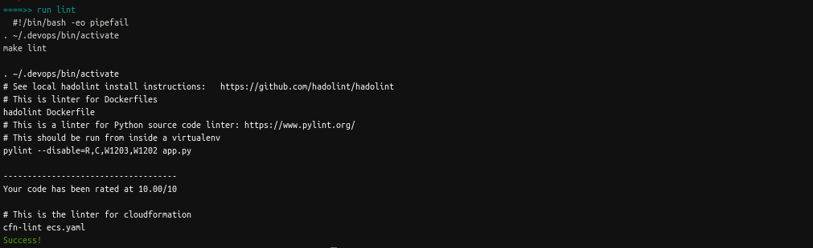

# devops-microservices-aws-kubernetes 

DevOps Microservices at Scale using AWS &amp; Kubernetes 

# Solution Details

-------------------

# Local Docker deployment (for local tests):

. `run_docker.sh` 

This will build a Docker image and runs the app locally 

. `make_prediction.sh` 

Run in another terminal to make a prediction.

# AWS ECS deployment:

. `upload_docker.sh` 

This will registers the app image on Dockerhub and AWS ECR.

. `ecs-deploy.sh`

This will deploy to AWS ECS clusters and create a service accessible via an elastic load balancer.
    
. `ecs.yaml` 

Contains the details of the AWS infrastructure created.

You must specify the following parameter: ECR image created, your EC2 keypair name and at least two subnets in your pre-existing VPC.

Ensure that the AWS infrastructure is deleted so that you do not incurred additional costs.
    
. `make_prediction_ecs.sh` 

Make a prediction using the running ecs service. You must specify the dns of the elastic load balancer

# Local Kubernetes deployment (for local tests):

. Pre-requisites: Install minikube and kubectl

. It uses the local Docker image from the step above

. `run_kubernetes.sh`

This will deploy a kubernetes cluster and apply a service locally 

. `make_prediction.sh` 

Run in another terminal to make a prediction using the kubernetes service.

# CircleCI Pipeline for automated deployment:

. `circleci/config.yml`

Contains the workflow for deployment to AWS ECS

. build job : 

Will run the linter

. deploy-app job : 

Will register the app image on Dockerhub and AWS ECR. 

Then deploy to AWS ECS clusters and create a service accessible via a public elastic load balancer.

# Miscelleneous:

To run the Linter for Dockerfile, python and cloudformation files 

. Prerequisite: Install CircleCI CLI

. `make run-circleci-local` 

This will run the build job found in .circleci/config.yml

Alternatively

. `make lint`

This will run in the isolated environment created with `make setup`

